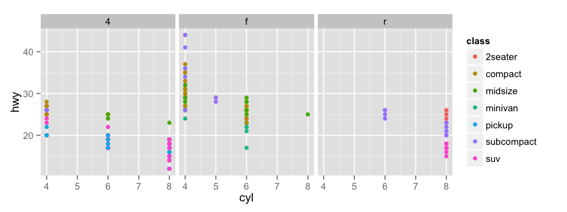

ShinyApp Pitch for "Basic Introduction to ggplot2"
========================================================
author: by E. Brian Welch using R version 3.1.1 (2014-07-10) and knitr version 1.6
date: October 26, 2014
transition: rotate
incremental: true

Why is the ShinyApp "Basic Introduction to ggplot2" needed?
========================================================

- Non-intuitive syntax of `ggplot` R commands
- Basic capabilities of `ggplot` not widely known
- Options such as `colour` and `facet_wrap` mysterious to many

Who needs this ShinyApp?
========================================================

- Anyone who wants to start using `ggplot` but was hesitant to make the leap
- Anyone teaching others how to use `ggplot` who needs a handy interactive example
- Anyone interested to see power and flexibility of `ggplot`
- Anyone wishing to observe power of the `eval` command

```r
ggplot_command = sprintf("g = ggplot(mpg, aes(x=%s, y=%s, colour=%s)) + facet_wrap(~%s) + geom_%s()",
                             input$x, input$y, input$colour, input$facet_wrap, input$geom)
    eval(parse(text=ggplot_command))
```

Example Command and Plot Generated by the ShinyApp "Basic Introduction to ggplot2"
========================================================


```r
g = ggplot(mpg, aes(x=cyl, y=hwy, colour=class)) + facet_wrap(~drv) + geom_point()
```
 

Try the ShinyApp "Basic Introduction to ggplot2" Today!
========================================================

- Deployed at [https://welcheb.shinyapps.io/DevelopingDataProductsProject](https://welcheb.shinyapps.io/DevelopingDataProductsProject)
- Need help? Please consult the documentation file: [documentation.html](https://welcheb.shinyapps.io/DevelopingDataProductsProject/_w_e8376343027861c011214724fbbea9b35eefa9e595262511/documentation.html)
- Code available at: [https://github.com/welcheb/DevelopingDataProductsProject](https://github.com/welcheb/DevelopingDataProductsProject) 
